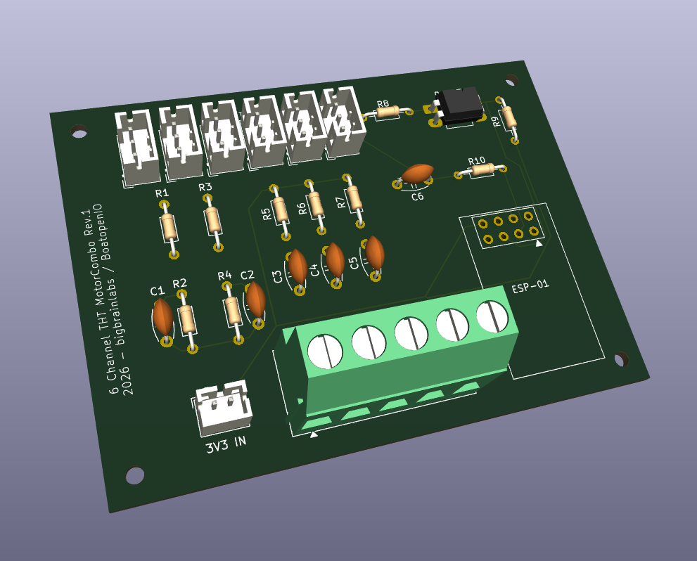

# MotorCombo THT — Combo Mini-Board for Engine Sensors

> 🚧 **Prototype stage.** This board (Rev.1) has not been fully validated yet. Five of the six channels are tested, the RPM channel is not (see below). Resistor values, mounting holes and layout may still change in future revisions. Build at your own risk, and ideally with feedback.

Through-hole (THT) variant of the MotorCombo board. Combines the six typical engine room signals onto a single board instead of plugging in six separate mini-boards.

Every part is through-hole — hand-solderable, no SMD equipment needed. For the SMD variant see [`../MotorCombo/`](../MotorCombo/).



---

## Channels

| Channel | Connector | Signal conditioning | Typical sensor |
|---------|-----------|---------------------|----------------|
| Battery 1 | `Batt1` | Voltage divider (R1 / R2) | 12 V house voltage |
| Battery 2 | `Batt2` | Voltage divider (R3 / R4) | Second battery bank |
| Tank | `Tank1` | Pull-up to 3.3 V (R5) | VDO tank sender, resistive |
| Temperature | `Temp1` | Pull-up to 3.3 V (R6) | VDO temperature sender, resistive |
| Oil pressure | `Oil1` | Pull-up to 3.3 V (R7) | VDO pressure sender, resistive |
| RPM | `RPM1` | Optocoupler PC817 + ESP-01 | Alternator W terminal, pulse pickup |

Every channel has a 100 nF capacitor for signal smoothing (C1–C6).

---

## Signal Path

Per the netlist, the JST 3-pin connectors are wired as **input / GND / output**: the raw signal arrives on pin 1, the conditioned signal returns on pin 3.

```
Pin 1 (raw) → conditioning → Pin 3 (conditioned)
Pin 2 = GND
```

**Voltage divider (Batt1, Batt2)**
```
Pin 1 ──[R1]──┬── Pin 3
              ├── C1 ── GND
              └──[R2]── GND
```

**Pull-up (tank, temperature, oil)**
```
3.3 V ──[R5]──┬── Pin 1 = Pin 3
              └── C3 ── GND
```
Pin 1 and pin 3 are tied together — the resistive sender forms the divider together with the pull-up resistor.

**RPM (RPM1)**
```
Pin 1 ──[R8]── PC817 LED ── GND
               PC817 transistor ── GPIO0 (ESP-01), pull-up R9
               GPIO2 ──[R10]──┬── Pin 3
                              └── C6 ── GND
```
The optocoupler isolates the pulse input galvanically. The ESP-01 counts the pulses and outputs an RPM-proportional value on pin 3.

---

## Connectors

| Designator | Type | Function |
|------------|------|----------|
| `Batt1`, `Batt2`, `Tank1`, `Temp1`, `Oil1`, `RPM1` | JST PH 3-pin, 2.0 mm | Channels to the main board |
| `J7` | JST PH 2-pin, 2.0 mm | 3.3 V / GND supply from the VCC board |
| `GND_Collector1` | Screw terminal 5-way, 5.08 mm | Common point for sensor grounds |

---

## Board

| | |
|---|---|
| Revision | Rev.1 |
| Dimensions | 75 × 55 mm |
| Layers | 2 |
| Assembly | through-hole throughout |
| Mounting | 4 holes, one per corner |
| Gerbers | [`gerber/`](gerber/) — ready to order, ZIP included |

---

## Bill of Materials

| Item | Part | Qty | Package |
|------|------|-----|---------|
| 1 | Resistor, axial | 10 | DIN0204, 7.62 mm pitch |
| 2 | Capacitor 100 nF, ceramic | 6 | disc D5 mm, 5.00 mm pitch |
| 3 | PC817 optocoupler | 1 | DIP-4 |
| 4 | ESP-01 (ESP8266) | 1 | ESP-01 module, 2×4 socket |
| 5 | JST PH header 3-pin, vertical | 6 | B3B-PH-K |
| 6 | JST PH header 2-pin, vertical | 1 | B2B-PH-K |
| 7 | Screw terminal 5-way | 1 | Phoenix MKDS-3/5-5.08 |

---

## Resistor Values

**Values R1–R10 are deliberately left open in the schematic.** VDO senders differ in resistance range depending on year and manufacturer — a value that works cleanly on one engine can cause distorted readings on the next. Rather than prescribing one size, everyone fits what matches their own senders.

The following values have proven themselves in practice and are a good starting point:

| Channel | Resistors | Recommended | Alternative |
|---------|-----------|-------------|-------------|
| Battery 1 | R1 / R2 | 10 kΩ / 2.2 kΩ | 100 kΩ / 22 kΩ |
| Battery 2 | R3 / R4 | 10 kΩ / 2.2 kΩ | 100 kΩ / 22 kΩ |
| Tank | R5 | 10 kΩ | adjust to your sender |
| Temperature | R6 | 10 kΩ | adjust to your sender |
| Oil pressure | R7 | 10 kΩ | adjust to your sender |

**Voltage dividers.** 10 kΩ / 2.2 kΩ is tested and works. The divider ratio is 2.2 / (10 + 2.2) = 0.180, so 12 V becomes roughly 2.16 V. As a factor in the channel configuration that works out to about **5.55**, and with a 3.3 V input limit the upper end lands at roughly 18 V. The 100 kΩ / 22 kΩ variant has the same ratio but loads the battery ten times less — at the cost of being more susceptible to interference.

**Pull-ups.** 10 kΩ has shown itself to be a good compromise in testing. If a sender uses a different resistance range, the pull-up should be adjusted along with it — best measured on the installed sender, choosing a value that makes good use of the measuring range.

**Optocoupler.** R8 sets the PC817 LED current, R9 is the pull-up at the ESP-01. This combination has not yet been proven in practice (see below).

---

## ESP-01 Notes

The ESP-01 is **socketed** — it needs a dedicated USB adapter for flashing anyway, so it is taken out of the board for programming. That is why `RST`, `URXD` and `UTXD` are left unconnected.

> 🚧 **The RPM channel via PC817 and ESP-01 has not been tested in practice yet.** The other five channels are proven.

Worth keeping in mind during assembly: on the ESP8266, `GPIO0` and `GPIO2` double as boot-mode straps, and both are wired here.

- **GPIO0** is tied to the optocoupler transistor. If a pulse happens to be present at power-on, the optocoupler pulls GPIO0 low and the ESP-01 boots into flash mode instead of running the firmware — quite possible with the engine running.
- **GPIO2** drives the output through R10. C6 is discharged at power-on — depending on the values chosen for R10 and C6, this may hold GPIO2 low for too long during boot.

Both depend on the values of R8, R9, R10 and C6, and can be settled together when the RPM channel is trialled.

> 💡 **Tip: use an ESP-01S instead of an ESP-01.** The newer ESP-01S variant already has a pull-up fitted on GPIO0. This mitigates the boot-mode issue above, since GPIO0 is safely held high at idle. The ESP-01S is pin-compatible and fits the same socket.

---

## Safety

> ⚠️ **Verify which channel sits on which terminal before applying power.**
>
> The battery channels are designed for 12 V through voltage dividers. If 12 V accidentally reaches one of the pull-up channels (tank, temperature, oil), it will destroy the MUX, ADS1115 and ESP32 through an I2C chain reaction. See the safety warning in the [main README](../../../README.md).

---

## License

GPL-3.0, same as the rest of the repo. See [LICENSE](../../../LICENSE).
